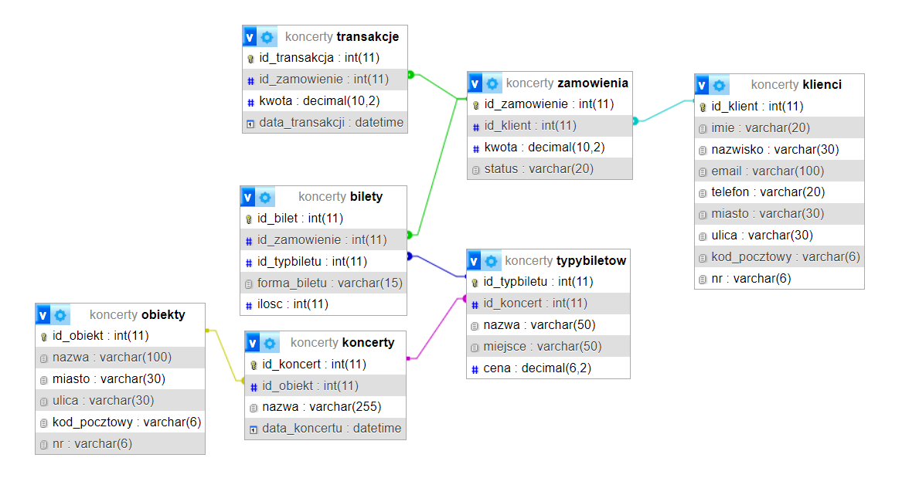

# Baza danych SQL (MySQL)

## Opis
Baza danych `koncerty` została zaprojektowana do zarządzania koncertami, klientami, zamówieniami biletów i transakcjami z nimi związanymi. 

## Struktura Tabel

1. **klienci**: Tabela przechowująca dane klientów, takie jak imię, nazwisko, email, telefon, adres.
2. **obiekty**: Tabela zawierająca informacje o obiektach koncertowych, takie jak nazwa, lokalizacja.
3. **koncerty**: Tabela zawierająca informacje o koncertach, takie jak nazwa, data, powiązanie z obiektem.
4. **zamowienia**: Tabela zawierająca zamówienia klientów z informacjami o kwocie zamówienia i statusie.
5. **transakcje**: Tabela zawierająca transakcje związane z opłatami za zamówienia klientów.
6. **typybiletow**: Tabela przechowująca różne typy biletów na koncerty.
7. **bilety**: Tabela zawierająca szczegóły biletów, takie jak forma biletu, ilość, powiązania z zamówieniami.

## Triggery

1. **walidacja_email**: Trigger przed dodaniem nowego klienta, który sprawdza poprawność formatu adresu email.
2. **after_insert_bilet**: Trigger wyzwalany po dodaniu nowego biletu, który aktualizuje kwotę zamówienia.
3. **after_delete_bilet**: Trigger wyzwalany po usunięciu biletu, który aktualizuje kwotę zamówienia.
4. **after_insert_transakcje**: Trigger wyzwalany po dodaniu nowej transakcji, który oznacza zamówienie jako opłacone.

## Procedury

1. **dodaj_bilet**: Procedura dodająca bilet do zamówienia lub tworząca nowe zamówienie, jeśli nie istnieje.
2. **dodaj_transakcje**: Procedura dodająca nową transakcję powiązaną z zamówieniem.
3. **pokaz_bilety**: Procedura zwracająca szczegóły biletów zakupionych przez określonego klienta.

